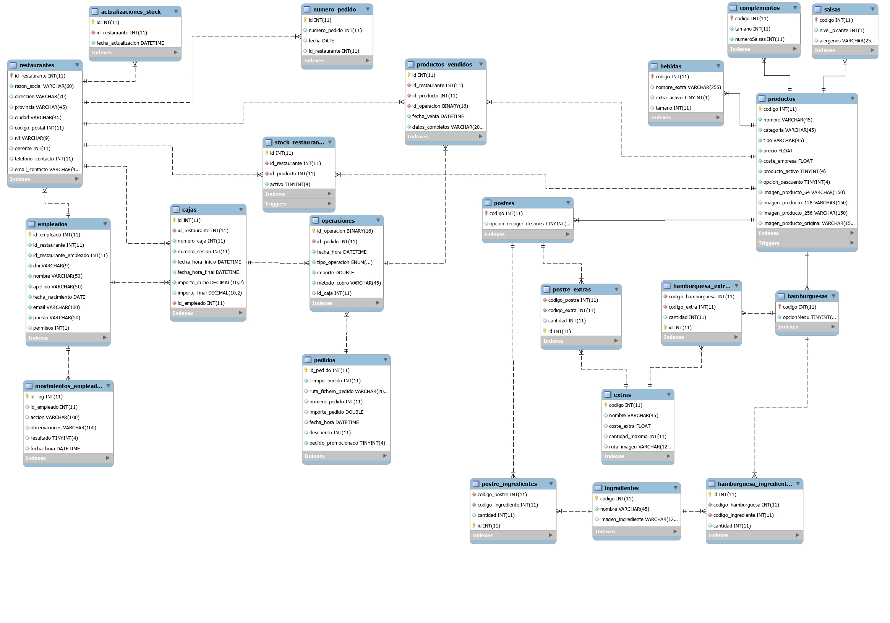
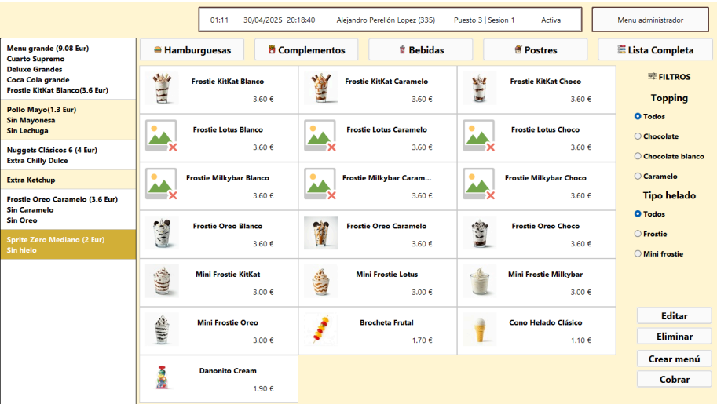
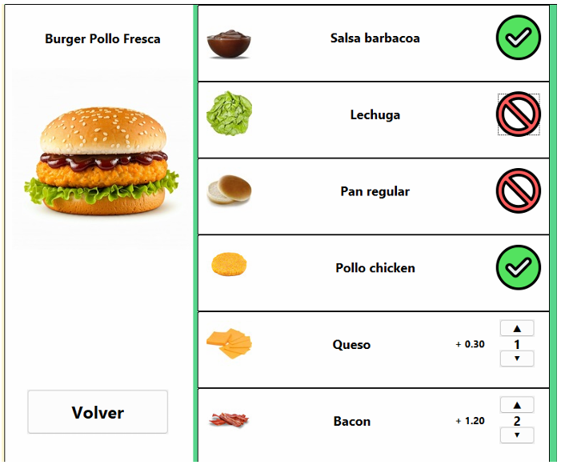

<div align="center">
  

  <h1>Fat & Happy POS</h1>
  <p><em>Proyecto de fin de ciclo (DAM) – Sistema POS modular para cadenas de restauración</em></p>

  <p>
    <a href="#caracteristicas"></a>
    <a href="#arquitectura"></a>
    <a href="#seguridad"></a>
    <a href="#base-de-datos"></a>
    <a href="#documentacion"></a>
  </p>
</div>

---

## Índice

* [Visión general](#visión-general)
* [Capturas](#capturas)
* [Características](#caracteristicas)
* [Arquitectura](#arquitectura)
* [Base de datos](#base-de-datos)
* [Seguridad](#seguridad)
* [Stack y versiones](#stack-y-versiones)
* [Instalación](#instalación)
* [Configuración](#configuración)
* [Ejecución](#ejecución)
* [Créditos y licencia](#créditos-y-licencia)

---

## Visión general

**Fat & Happy POS** es un sistema de punto de venta (POS) para restauración con enfoque en:

* **Selección y personalización de productos** (imágenes, variantes, ingredientes/extras).
* **Gestión de empleados y permisos** (auditoría de acciones).
* **Cadenas de producción** con **comunicación cliente–servidor** mediante **sockets**.
* **Control de stock** por restaurante y **registro de ventas** centralizado.

El objetivo es mejorar la eficiencia operativa (toma de pedidos más rápida, preparación ordenada por prioridades/zonas) y la trazabilidad completa de la operación.

---

## Capturas

| Esquema BBDD                             | App – Selección de productos                      | App – Edición de producto                     |
| ---------------------------------------- | ------------------------------------------------- | --------------------------------------------- |
|  |  |  |

---

## Características

* POS **modular** (Productos, Empleados, Cajas, Pedido, Auxiliares).
* **Código de producto** normalizado `CCTTNNVV` (categoría, tipo, base, variante).
* **Imágenes, precio y filtros** en selección de productos.
* **Pedidos** con menús, descuentos/promociones, para llevar/mesa.
* **Caja**: sesiones, cobros/devoluciones, ticket/resumen JSON.
* **Auditoría**: movimientos de empleados, operaciones y ventas.
* **Servidor** multihilo (ping/pong, purga de clientes, reconexión).
* **Raspberry Pi** como servidor de BD y servicios (bajo consumo).

---

## Arquitectura

**Cliente (Java)**

* Interfaz Swing/Java (paneles de productos, caja, descuentos, pedidos).
* Hilos de actualización (stock, pedidos) y contador de tiempo.
* Estructura por paquetes: `productos/`, `empleados/`, `cajas/`, `pedido/`, `auxiliares/` etc.
* Persistencia con **Hibernate** (DAO), utilidades, paneles dinámicos.

**Servidor (Java)**

* `ServerSocket` (puerto configurable), un **SocketCliente** por conexión.
* Hilos: **Recibir**/*Procesar* objetos y **Enviar** respuestas.
* **Ping/Pong** para salud de la conexión; **purga** de clientes inactivos.

**Servicios de soporte** (en servidor):

* **MariaDB** para datos operativos.
* **FTP** (vsftpd) para recursos estáticos (imágenes de productos).
* **SSH** para administración.

---

## Base de datos

* **Diseño centralizado**: múltiples restaurantes en una BD → análisis comparativo y trazabilidad.
* Tablas clave: `productos`, `hamburguesas`, `postres`, `ingredientes`, `extras`, `stock_restaurante`, `productos_vendidos`, `empleados`, `movimientos_empleados`, `cajas`, `pedidos`, `operaciones`, `restaurantes`, `numero_pedido`, etc.
* **Triggers**:

  * Alta de producto → inserta filas en `stock_restaurante` para cada restaurante.
  * Actualización de stock → inserta registro en `actualizaciones_stock` para detección eficiente de cambios.
* **Esquema**: ver [`docs/img/modelo-bbdd.png`](docs/img/modelo-bbdd.jpg).
* **Código de producto `CCTTNNVV`** (8 dígitos): CC=categoría, TT=tipo, NN=nombre base, VV=variante.

---

## Seguridad

Resumen del hardening aplicado al servidor (Raspberry Pi):

* **SSH** en puerto personalizado y acceso protegido (cambio de puerto por defecto, opciones seguras en `sshd_config`).
* **Firewall UFW**: solo puertos necesarios (SSH y MariaDB, y FTP si aplica).
* **Fail2Ban**: bloqueo de fuerza bruta (jails para `sshd` y `vsftpd`).
* **MariaDB** endurecida\*\* con `mysql_secure_installation` (root protegido, anonimato y `test` deshabilitados, privilegios mínimos).
* **FTP (vsftpd)** en puerto personalizado + **modo pasivo** con rango corto + chroot de usuarios.
* **Verificación**: escaneo de puertos expuestos y prueba de baneo de IP.

> **Nota**: ajusta puertos, reglas y whitelist según tu red. Evita exponer la BD directamente a Internet; prioriza túneles/SSH/VPN.

---

## Stack y versiones

> Referencia utilizada en esta entrega; ajusta según tu entorno.

* **Java** 17 LTS
* **Hibernate** 6.x
* **MariaDB** 10.x
* **Cliente/Servidor** Java puro (sockets)
* **FTP** vsftpd · **Firewall** UFW · **Fail2Ban**

---

## Instalación

1. **Clonar** el repositorio y preparar imágenes en `docs/img/` (logo, pantallas, modelo BBDD).
2. **Base de datos** (MariaDB):

   * Crear BD y usuario con privilegios mínimos.
   * Importar el esquema y datos iniciales (scripts SQL en `/db` si los publicas).
   * Verificar índices y claves foráneas.
3. **Configurar** `hibernate.cfg.xml` (o propiedades equivalentes):

   ```xml
   <!-- ejemplo básico -->
   <hibernate-configuration>
     <session-factory>
       <property name="hibernate.connection.url">jdbc:mariadb://HOST:3306/RESTO_DB</property>
       <property name="hibernate.connection.username">restaurante_user</property>
       <property name="hibernate.connection.password">********</property>
       <property name="hibernate.dialect">org.hibernate.dialect.MariaDBDialect</property>
       <property name="hibernate.hbm2ddl.auto">validate</property>
       <property name="hibernate.show_sql">false</property>
     </session-factory>
   </hibernate-configuration>
   ```
4. **Servidor**: definir puertos (sockets/SSH/FTP) y reglas de firewall (ver [Seguridad](#seguridad)).

---

## Configuración

* **Variables de entorno** sugeridas:

  * `FHPOS_DB_URL`, `FHPOS_DB_USER`, `FHPOS_DB_PASS`
  * `FHPOS_FTP_HOST`, `FHPOS_FTP_PORT`, `FHPOS_FTP_USER`, `FHPOS_FTP_PASS`
  * `FHPOS_SERVER_PORT` (sockets)
* **Recursos**: el cliente descarga imágenes de productos desde FTP en el arranque.
* **Logs**: usa `log4j` para eventos (errores, auditoría de interés).

---

## Ejecución

### Servidor

* Compilar/empacar con Maven y ejecutar el **main** del servidor (ej. `IniciarServidor`).
* Mantiene `ServerSocket` y lanza hilos por cliente (recibir/enviar); tareas periódicas de ping/pong y purga.

### Cliente

* Ejecutar `InicioAplicacion`.
* Flujo: carga de recursos → productos activos → interfaz de pedido → cobro → registro (operaciones + productos vendidos).

---

## Documentación

* **JavaDoc**: ver `/docs/javadoc/` (o link a GitHub Pages).
* **Modelo BBDD**: `docs/img/modelo-bbdd.png`.

---

## Créditos y licencia

* Autor: **Alejandro Perellón López**.
* **Disclaimer**: Las marcas de terceros que puedan aparecer en ejemplos pertenecen a sus respectivos propietarios; se usan con fines ilustrativos.
* Licencia: MIT
